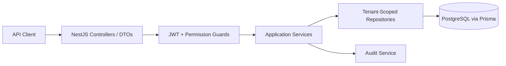

# Multi-Tenant IAM Backend Platform

Production-oriented demo backend for a multi-tenant IAM platform built with NestJS, TypeScript, PostgreSQL, Prisma, JWT authentication, tenant-scoped RBAC permissions, audit logging, and tests.

This is not a commercial IAM product and does not claim NIST compliance. It is designed to demonstrate senior backend architecture, tenant isolation, authorization, auditability, and testability for identity, integrations, enterprise SaaS, and platform engineering interviews.

## Why This Exists

IAM systems fail in predictable places: weak credential handling, broken object-level authorization, confused tenant context, missing audit trails, and tests that only cover happy paths. This repository focuses on those risks with a compact but production-shaped backend.

## Architecture



Main modules:
- `auth`: register, login, refresh token rotation, logout, current user.
- `tenants` / `organizations`: tenant membership context.
- `users` / `memberships`: tenant-scoped user and membership management.
- `roles` / `permissions`: tenant role definitions and permission catalog.
- `projects`: sample tenant-owned resource used to prove object-level authorization.
- `audit`: security event storage and tenant-scoped audit reads.
- `health`: liveness, readiness, and basic Prometheus-style metrics.
- `database`, `config`, `common`: Prisma, env validation, guards, filters, decorators.

## Security Model

- Passwords are hashed with Argon2.
- Access tokens are short-lived JWTs containing `sub`, active tenant id, email, and tenant role.
- Refresh tokens are opaque random values stored only as SHA-256 hashes and rotated on use.
- Route authorization uses explicit permissions such as `projects:read` and `users:manage`.
- Tenant-owned repository methods require `organizationId` and object id together.
- Cross-tenant object ids return not found instead of leaking object existence.
- Security-sensitive actions are written to `audit_events`.
- Global validation rejects unknown DTO fields.
- Error responses use a consistent safe shape with correlation ids.

The password and session guidance is aligned conceptually with modern digital identity recommendations, including NIST SP 800-63-4 concepts such as verifier-side protections and avoiding overclaiming compliance.

## Tenant Isolation

This project uses a shared PostgreSQL schema with `organization_id` as the tenant boundary. Tenant isolation is enforced at several layers:

- JWT establishes the active tenant context.
- Guards validate authentication and permissions.
- Services enforce invariants such as "do not remove the last tenant admin."
- Repositories scope reads, updates, and deletes by both tenant id and resource id.
- Database indexes and unique constraints include `organization_id` where tenant uniqueness matters.
- Tests assert that tenant A cannot read tenant B project ids.

## Authorization Model

Built-in tenant roles:
- `ORG_ADMIN`: full tenant administration and audit read access.
- `ORG_USER`: user/project read and project write access.
- `READ_ONLY`: read-only tenant/project access.

Roles are tenant-scoped. The same user can be `ORG_ADMIN` in tenant A and `READ_ONLY` in tenant B because the active tenant context is part of the token and membership.

## Database Summary

Core tables:
- `organizations`, `users`, `organization_memberships`
- `roles`, `permissions`, `role_permissions`
- `refresh_tokens`
- `audit_events`
- `projects`

Seed data creates two tenants, multiple users, roles, permissions, memberships, and isolated sample projects.

## API Examples

```bash
curl -X POST http://localhost:3000/api/v1/auth/login \
  -H 'content-type: application/json' \
  -d '{"email":"admin@acme.test","password":"ChangeMe123!acme"}'
```

```bash
curl http://localhost:3000/api/v1/projects \
  -H "authorization: Bearer $ACCESS_TOKEN"
```

OpenAPI JSON is available at:

```text
GET /api/v1/openapi.json
```

Operational endpoints:

```text
GET /health
GET /health/live
GET /health/ready
GET /metrics
```

## Local Setup

Requirements:
- Node.js 20+
- Docker with Compose

```bash
npm install
cp .env.example .env
docker compose up -d db
npm run prisma:generate
npm run prisma:migrate
npm run prisma:seed
npm run start:dev
```

The API runs on `http://localhost:3000`.

## Verification

```bash
npm run lint
npm run test
npm run test:e2e
npm run build
npm run security:audit
```

The test suite includes unit tests for services and guards plus e2e coverage for invalid JWTs, missing permissions, OpenAPI exposure, and tenant-scoped object access.

## CI/CD

GitHub Actions installs dependencies, generates Prisma client code, applies migrations against Postgres, seeds data, runs lint/typecheck/build, executes unit and e2e tests, and runs a high-severity dependency audit.

## Tradeoffs

- This demo uses a shared schema instead of database-per-tenant isolation to keep local review simple.
- Permission evaluation is deterministic from tenant role keys while role and permission tables make the model inspectable and extensible.
- Refresh token rotation is implemented, but device/session management UI and risk-based authentication are out of scope.
- OpenAPI is served as a lightweight JSON document instead of depending on Swagger UI runtime packages.

## Production Hardening Checklist

- Move secrets to a managed secret store.
- Add managed rate limiting at the edge or API gateway.
- Add OpenTelemetry traces and structured log export.
- Add database row-level security if operating in a hostile SQL environment.
- Add email verification, account recovery, and step-up authentication.
- Add SCIM, SAML, and external OIDC provider integrations.
- Add Microsoft Entra ID and Google Workspace provisioning examples.

## More Docs

- [Architecture](docs/ARCHITECTURE.md)
- [Security](docs/SECURITY.md)
- [Testing](docs/TESTING.md)
- [API](docs/API.md)
- [ADRs](docs/adr/0001-tenant-scoped-rbac.md)
