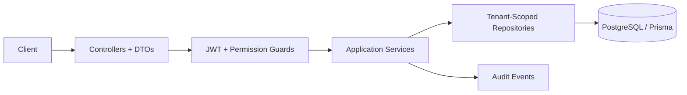

# Multi-Tenant IAM Backend Platform

Portfolio backend demo for a multi-tenant IAM platform using **NestJS**, **TypeScript**, **PostgreSQL**, **Prisma**, **JWT**, tenant-scoped RBAC permissions, refresh-token rotation, audit logging, Docker, CI, and security-focused tests.

This is not a commercial IAM product and does not claim regulatory or NIST compliance. The goal is to show backend judgment around identity, tenant isolation, authorization, auditability, and testability.

## What This Demonstrates

- Clean module boundaries for `auth`, `tenants`, `users`, `memberships`, `roles`, `permissions`, `projects`, `audit`, `health`, `database`, and shared `common` code.
- JWT access-token validation plus opaque refresh tokens hashed at rest and rotated on use.
- Tenant-scoped RBAC where the same user can have different roles in different tenants.
- Permission guards using explicit permissions such as `projects:read`, `users:manage`, and `audit:read`.
- Repository-level object isolation using both `organizationId` and resource id.
- Defensive behavior for broken object-level authorization: cross-tenant object access returns `404`.
- Audit events for login, refresh rotation, tenant/user/membership changes, and project mutations.
- Tests for invalid JWTs, missing permissions, refresh-token rotation, expired/reused refresh tokens, audit creation, last-admin rules, and cross-tenant mutation denial.

## Architecture



Controllers handle HTTP and validation. Services enforce use-case rules. Repositories own Prisma queries and tenant scoping.

## Security Model

- Passwords are hashed with Argon2.
- Access tokens include user id, email, active tenant id, and tenant role.
- Refresh tokens are random opaque values stored only as SHA-256 hashes.
- Refresh-token reuse is denied after rotation because the old token is revoked.
- Expired refresh tokens are excluded by the repository query.
- Tenant-owned reads, updates, and deletes are scoped by tenant id and object id.
- Global validation rejects unknown request fields.
- Error responses are consistent and include a correlation id.
- Basic hardening includes CORS config, security headers, auth rate limiting, env validation, and no committed secrets.

More detail: [SECURITY.md](SECURITY.md)

## Tenant And Authorization Model

Shared-schema tenancy uses `organization_id` as the tenant boundary.

Built-in tenant roles:
- `ORG_ADMIN`: tenant administration, users, memberships, projects, audit reads.
- `ORG_USER`: user/project reads and project writes.
- `READ_ONLY`: read-only tenant/project access.

Permissions are evaluated inside the active tenant context from the authenticated request.

## Core Tables

- `organizations`
- `users`
- `organization_memberships`
- `roles`
- `permissions`
- `role_permissions`
- `refresh_tokens`
- `audit_events`
- `projects`

Seed data creates two isolated tenants, users, roles, permissions, memberships, and sample projects.

## API Surface

Base path: `/api/v1`

Key endpoints:
- `POST /auth/register`
- `POST /auth/login`
- `POST /auth/refresh`
- `POST /auth/logout`
- `GET /auth/me`
- `GET /tenants`
- `GET /users`
- `POST /users`
- `GET /memberships`
- `PATCH /memberships/:userId/role`
- `DELETE /memberships/:userId`
- `GET /roles`
- `GET /permissions`
- `GET /projects`
- `POST /projects`
- `GET /projects/:id`
- `PATCH /projects/:id`
- `DELETE /projects/:id`
- `GET /audit/events`

Operational endpoints:
- `GET /health`
- `GET /health/live`
- `GET /health/ready`
- `GET /metrics`
- `GET /api/v1/openapi.json`

## Quickstart

Requirements:
- Node.js 20 (`.nvmrc` included)
- Docker with Compose

```bash
npm install
cp .env.example .env
docker compose up -d db
npm run prisma:generate
npm run prisma:migrate
npm run prisma:seed
npm run start:dev
```

Seed users:

```text
admin@acme.test / ChangeMe123!acme
member@acme.test / ChangeMe123!acme
viewer@acme.test / ChangeMe123!acme
admin@globex.test / ChangeMe123!globex
viewer@globex.test / ChangeMe123!globex
```

Login:

```bash
curl -X POST http://localhost:3000/api/v1/auth/login \
  -H 'content-type: application/json' \
  -d '{"email":"admin@acme.test","password":"ChangeMe123!acme"}'
```

Use the returned access token:

```bash
curl http://localhost:3000/api/v1/projects \
  -H "authorization: Bearer $ACCESS_TOKEN"
```

## Verification

```bash
npm run lint
npm run test
npm run test:e2e
npm run build
npm run security:audit
```

`npm run security:audit` requires network access to the npm registry. In restricted environments it can fail with DNS or registry access errors even when the script is valid.

## Tradeoffs

- Shared-schema tenancy keeps local review simple; database-per-tenant isolation is out of scope.
- RBAC is implemented with explicit permissions and tenant memberships; custom role editing can be added later.
- External OIDC, SAML, SCIM, MFA, passkeys, Microsoft Entra ID, and Google Workspace integrations are intentionally out of scope.
- Audit writes are best-effort so an audit storage failure does not take down the primary request path.
