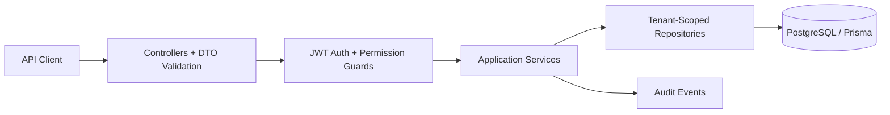

# Multi-Tenant IAM Backend Platform

Production-oriented backend demo for a multi-tenant IAM platform built with **NestJS**, **TypeScript**, **PostgreSQL**, **Prisma**, **JWT**, tenant-scoped **RBAC permissions**, refresh-token rotation, audit logging, health checks, CI, Docker, and security-focused tests.

This is not a commercial IAM product and does not claim formal NIST compliance. It is designed to demonstrate senior backend architecture, tenant isolation, authorization, auditability, and testability for identity, integrations, enterprise SaaS, and platform engineering roles.

## 5-Minute Review

**What this proves:** the backend handles the core IAM risks reviewers care about: authentication, authorization, tenant isolation, object-level access control, auditability, and automated verification.

**Best signals in the repo:**
- Clean NestJS module boundaries: `auth`, `tenants`, `users`, `memberships`, `roles`, `permissions`, `projects`, `audit`, `health`, `database`, `config`, `common`.
- Tenant isolation is enforced in services and repositories, not trusted from route params.
- Permission guards use explicit permissions like `projects:read`, `projects:write`, `users:manage`, and `audit:read`.
- Refresh tokens are opaque, hashed at rest, and rotated on use.
- Audit events are recorded for security-sensitive actions.
- Tests cover invalid JWTs, missing permissions, tenant-scoped object access, and last-admin protections.
- README claims are intentionally scoped to what the code implements.

## Architecture



Controllers handle HTTP concerns only. Services own application behavior and invariants. Repositories own Prisma access and must include `organizationId` for tenant-owned resources.

## Security Model

- Passwords are hashed with Argon2.
- Access tokens are short-lived JWTs with user id, email, active tenant id, and tenant role.
- Refresh tokens are random opaque tokens stored only as SHA-256 hashes.
- Refresh token rotation revokes the previous token on use.
- Permission checks are route-level and explicit.
- Tenant-owned reads, updates, and deletes are scoped by both resource id and tenant id.
- Cross-tenant object access returns `404 Not Found` to avoid leaking object existence.
- Global validation rejects unknown request fields.
- Error responses are consistent and include a correlation id.
- Basic hardening includes CORS config, security headers, auth rate limiting, env validation, and no committed secrets.

## Tenant And Authorization Model

The platform uses shared-schema multi-tenancy with `organization_id` as the tenant boundary.

Built-in tenant roles:
- `ORG_ADMIN`: tenant administration, users, roles, projects, audit.
- `ORG_USER`: tenant/project read and project write.
- `READ_ONLY`: read-only tenant/project access.

Roles are tenant-scoped. A user can be `ORG_ADMIN` in tenant A and `READ_ONLY` in tenant B because permissions are evaluated inside the active tenant context.

## Database Model

Core tables:
- `organizations`
- `users`
- `organization_memberships`
- `roles`
- `permissions`
- `role_permissions`
- `refresh_tokens`
- `audit_events`
- `projects`

Important constraints and indexes include tenant-aware project uniqueness, membership uniqueness per tenant/user, and audit indexes by tenant, actor, action, and timestamp.

Seed data creates two tenants with separate users, roles, permissions, memberships, and projects to prove isolation.

## API Surface

Base path:

```text
/api/v1
```

Key endpoints:
- `POST /auth/register`
- `POST /auth/login`
- `POST /auth/refresh`
- `POST /auth/logout`
- `GET /auth/me`
- `GET /tenants`
- `GET /users`
- `POST /users`
- `GET /memberships`
- `PATCH /memberships/:userId/role`
- `GET /roles`
- `GET /permissions`
- `GET /projects`
- `POST /projects`
- `GET /projects/:id`
- `PATCH /projects/:id`
- `DELETE /projects/:id`
- `GET /audit/events`

Operational endpoints:
- `GET /health`
- `GET /health/live`
- `GET /health/ready`
- `GET /metrics`
- `GET /api/v1/openapi.json`

## Quickstart

Requirements:
- Node.js 20+
- Docker with Compose

```bash
npm install
cp .env.example .env
docker compose up -d db
npm run prisma:generate
npm run prisma:migrate
npm run prisma:seed
npm run start:dev
```

API URL:

```text
http://localhost:3000
```

Seed users:

```text
admin@acme.test / ChangeMe123!acme
member@acme.test / ChangeMe123!acme
viewer@acme.test / ChangeMe123!acme
admin@globex.test / ChangeMe123!globex
viewer@globex.test / ChangeMe123!globex
```

Login example:

```bash
curl -X POST http://localhost:3000/api/v1/auth/login \
  -H 'content-type: application/json' \
  -d '{"email":"admin@acme.test","password":"ChangeMe123!acme"}'
```

Tenant-scoped request:

```bash
curl http://localhost:3000/api/v1/projects \
  -H "authorization: Bearer $ACCESS_TOKEN"
```

## Verification

```bash
npm run lint
npm run test
npm run test:e2e
npm run build
npm run security:audit
```

CI runs install, Prisma generate, migrations, seed, lint, typecheck, build, unit tests, e2e tests, and high-severity dependency audit against PostgreSQL.

## Key Tests

- Invalid JWT is rejected.
- Missing permission returns forbidden.
- Tenant A cannot access tenant B project ids.
- Project repository scopes point reads and updates by tenant id and object id.
- Last tenant admin cannot be demoted or removed.
- Health and OpenAPI endpoints are available.

## Tradeoffs And Scope

- Shared-schema tenancy was chosen for reviewer-friendly local setup; database-per-tenant would add operational complexity.
- RBAC is implemented with explicit permissions and tenant memberships; custom roles can be added later.
- NIST SP 800-63-4 is referenced only conceptually: password/session choices are aligned with modern guidance, but this project does not claim compliance.
- External OIDC, SAML, SCIM, MFA, passkeys, Microsoft Entra ID, and Google Workspace integrations are intentionally out of scope for this demo, but the module boundaries are designed to support them later.

## Recent Engineering Decisions

- Prisma and PostgreSQL were chosen for strong relational constraints, migrations, and readable schema review.
- Permission decorators replaced controller-local role logic to make authorization intent easy to scan.
- Tenant-owned repositories require tenant scope to prevent broken object-level authorization.
- Audit writes are best-effort so security logging failures do not take down the primary request path.
