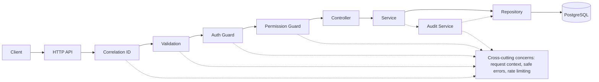

# Multi-Tenant IAM Backend Platform

This repository is a production-oriented reference implementation of a multi-tenant IAM backend platform. It focuses on tenant isolation, RBAC, authorization boundaries, refresh token rotation, auditability, observability, and testability.

## Project Overview

The system is a NestJS and TypeScript backend that models the core identity and access-management concerns of a shared-schema, multi-tenant platform. It uses PostgreSQL through Prisma, JWT access tokens, opaque refresh token rotation, tenant-scoped RBAC, and audit events to support secure API access across isolated tenant contexts.

The hard part is not issuing tokens or serving CRUD endpoints. It is ensuring that once a user belongs to more than one tenant, every request is evaluated in the right tenant context, every repository query is scoped correctly, and every permission decision stays consistent across the controller, service, and persistence layers. That is where many IAM backends fail, especially when route parameters are trusted too early or authorization is treated as a global role lookup instead of a tenant-scoped decision.

This backend makes those risks visible. It covers object-level access control, safe refresh token rotation, permission-based API boundaries, audit evidence for sensitive actions, and operational health, readiness, and metrics endpoints. It also shows the practical value of strict request validation and repository-level tenant filtering when the same resource type exists in multiple tenants.

Technology used in the implementation:

- NestJS for module boundaries, guards, filters, and HTTP controllers.
- TypeScript for strongly typed application and repository code.
- PostgreSQL as the shared relational datastore.
- Prisma for schema modeling and tenant-scoped data access.
- JWT access tokens for authenticated API calls.
- Opaque refresh token rotation with hashed storage.
- Tenant-scoped RBAC for authorization decisions.
- Audit events for security-sensitive actions.
- OpenAPI for API discovery and contract visibility.
- Health, readiness, and metrics endpoints for operational checks.
- Automated tests for authorization, token handling, tenant isolation, and audit behavior.

## What This Covers

- Tenant isolation across controller, service, and repository boundaries.
- Object-level authorization instead of trusting route IDs alone.
- Permission-based RBAC driven by explicit route metadata.
- Refresh token lifecycle management with rotation and revocation.
- Auditability for authentication and security-sensitive mutations.
- Secure API boundaries with global validation and safe error shaping.
- Repository-level tenant scoping as the last line of defense.
- Testable backend architecture with clear separation of concerns.
- Production-style health, readiness, and metrics endpoints.

## Quick Start

```bash
nvm use
npm install
cp .env.example .env
docker compose up -d db
npm run prisma:generate
npm run prisma:migrate
npm run prisma:seed
npm run start:dev
```

## Architecture Diagram



The pipeline keeps the request path readable: the API establishes context, validation blocks malformed input, guards enforce authentication and permission checks, controllers hand off to services, services coordinate use cases, repositories apply tenant scoping, and audit writes remain a separate concern.

## Runtime Request Flow

The normal request lifecycle is intentionally explicit:

1. Client sends a request to `/api/v1/...`.
2. Correlation ID middleware attaches or reuses a correlation ID and echoes it in the response.
3. Global validation checks body, query, and route parameters with whitelist and reject-unknown-field behavior.
4. JWT auth guard validates the bearer access token.
5. The active tenant is resolved from the authenticated token and membership context.
6. Permission guard checks the route’s required permission inside the active tenant.
7. The service layer executes the application use case.
8. The repository layer scopes the query by `organization_id` and resource id.
9. PostgreSQL returns only tenant-owned records.
10. Audit event creation records security-sensitive actions when the use case requires it.
11. The API returns a safe success response or a safe error response with correlation metadata.

The important architectural point is that tenant scoping is not a controller convention. It is enforced again in the service and repository layers so that a malformed request, a mistaken caller, or a missed guard does not turn into a cross-tenant leak.

## Authentication Flow

Authentication is built around short-lived JWT access tokens and opaque refresh tokens.

Login flow:

Client -> AuthController -> AuthService -> UserRepository -> Password Hash Check -> Access Token + Refresh Token

Behavior implemented in the code:

- Password verification uses Argon2 hashing.
- A successful login selects the active organization context for the user.
- Access tokens are issued as JWTs.
- Refresh tokens are random opaque values generated with `randomBytes(48)`.
- Refresh tokens are stored only as SHA-256 hashes.
- Login success and failure both write audit events.

Refresh flow:

Client -> Refresh Endpoint -> Validate Refresh Token -> Rotate Token -> Revoke Old Token -> Issue New Pair

Behavior implemented in the code:

- The presented refresh token is hashed before lookup.
- Only active, unrevoked, unexpired refresh tokens are accepted.
- Refresh token rotation revokes the old token and links it to the replacement token id.
- Reuse of an old refresh token is denied because the repository no longer returns revoked tokens.
- Expired refresh tokens are rejected by repository query conditions.
- Refresh rotation writes an audit event.

Logout and revocation are implemented. Logout looks up the active refresh token and revokes it if found, then writes an audit event for the revocation.

## Authorization Model

The platform uses tenant-scoped RBAC, not global role ranking.

Core concepts:

- Users are identity principals.
- Tenants are the isolation boundary.
- Memberships link users to tenants.
- Roles describe tenant-local operating modes such as admin or read-only.
- Permissions are the atomic authorization units used by routes.
- Role permissions map roles to permissions.
- Active tenant context determines which role assignment applies to a request.

The key idea is that a user can be an admin in Tenant A and only a viewer in Tenant B. Permissions are evaluated inside the active tenant, not globally. That prevents an over-privileged interpretation of the user’s identity when the same user belongs to multiple organizations.

Authorization is implemented through decorators and guards:

- `@RequirePermissions(...)` marks the permissions a route needs.
- JWT auth guard establishes the authenticated principal.
- Permission guard reads route metadata and checks granted permissions in the request context.
- Membership checks ensure the user actually belongs to the target tenant before token issuance or tenant-scoped actions proceed.

This is better than simple role ranking because a role label alone does not describe the exact permission set, the tenant context, or whether the membership is still valid. The permission model is explicit, composable, and easier to test than a single global role hierarchy.

## Tenant Isolation Model

Tenant isolation is the central security property of the backend.

The implementation follows a strict model:

- Every tenant-owned resource has `organization_id` in the database model.
- Every repository query must scope by `organization_id`.
- Route IDs are never trusted alone.
- Object-level authorization is enforced in the service and repository layers.
- Tenant A cannot read or mutate Tenant B resources.
- Tests prove tenant isolation at both the repository and request levels.

The repository method shape is important.

Bad:

```ts
findProjectById(projectId)
```

Good:

```ts
findProjectByIdForTenant(projectId, tenantId)
```

The good version prevents broken object-level authorization because the lookup itself requires the tenant boundary. A caller cannot accidentally fetch a valid project id from another tenant unless it also has the correct tenant context. That reduces the chance of leaking objects through a globally unique identifier.

This repository uses the same pattern for point reads, updates, deletes, and list queries.

## Database Model

The schema is a shared PostgreSQL model with tenant ownership represented by `organization_id`.

Main tables:

- `users` stores identity records and password hashes.
- `organizations` stores tenant records.
- `organization_memberships` links users to tenants and stores the tenant-local role.
- `roles` stores tenant-local roles and their system keys.
- `permissions` stores atomic permissions.
- `role_permissions` maps roles to permissions.
- `refresh_tokens` stores hashed refresh tokens, expiry, and revocation state.
- `audit_events` stores security and operational audit records.
- `projects` stores reference tenant-owned resources and enforces isolation rules.

Important constraints and patterns:

- Tenant-scoped uniqueness is enforced where required, such as membership uniqueness and tenant-local role keys.
- Foreign keys keep ownership and membership relationships consistent.
- Indexes support tenant-scoped reads and audit retrieval.
- `created_at` and `updated_at` timestamps support traceability and operational debugging.
- Audit events preserve a durable trail of important security actions.

The schema is intentionally readable rather than overloaded. It is sufficient to model multi-tenant IAM design without turning the repository into a full identity suite.

## Auditability

Auditability is a first-class concern in IAM because security incidents, administrative changes, and authorization failures are only useful if they can be traced after the fact.

This platform records audit events for actions such as:

- Login success and failure.
- Refresh token rotation.
- Logout and refresh token revocation.
- Tenant creation.
- Membership creation and removal.
- Role assignment or role changes.
- Permission-sensitive project mutations.
- Forbidden access attempts when the use case records them.

The stored metadata is designed for later investigation and correlation:

- Actor user id.
- Tenant id.
- Action name.
- Target resource type.
- Target resource id.
- Correlation ID from the request path or middleware context.
- Timestamp.
- Success or failure context when the use case records it.

Audit writes are centralized through an audit service so the rest of the codebase does not need to duplicate persistence logic. When audit persistence fails, the implementation logs the failure instead of taking down the primary request path.

## API Surface

Base path for application routes: `/api/v1`

Main API groups:

- `/api/v1/auth` for register, login, refresh, logout, and current-user flows.
- `/api/v1/tenants` for tenant listing and creation.
- `/api/v1/memberships` for membership management.
- `/api/v1/roles` for role discovery.
- `/api/v1/permissions` for permission discovery.
- `/api/v1/projects` for tenant-owned resource CRUD.
- `/api/v1/audit/events` for audit event retrieval.
- `/health` for liveness.
- `/health/live` for the explicit live check.
- `/health/ready` for readiness.
- `/metrics` for lightweight operational metrics.
- `/docs` for the docs landing page.
- `/api/v1/openapi.json` for the OpenAPI document.

OpenAPI docs are served directly by the application. Use `/docs` for the HTML landing page and `/api/v1/openapi.json` for the machine-readable specification.

## Observability and Operations

The application includes operational features that matter in a real backend:

- Correlation IDs are attached to requests and returned in responses.
- Structured error responses include safe diagnostic detail and a correlation id.
- Health endpoints distinguish liveness from readiness.
- The readiness endpoint checks database connectivity.
- The metrics endpoint exposes basic Prometheus-style runtime information.
- Auth endpoints are rate limited to reduce brute-force pressure.
- Validation failures are rejected before application logic runs.

Practical debugging guidance:

- To debug a denied request, check the correlation id, the authenticated user, the active tenant, and the required permission on the route.
- To trace a tenant isolation issue, confirm that the repository method takes both the resource id and tenant id and that the database query includes both conditions.
- To verify audit events, inspect the audit event table or the `/api/v1/audit/events` endpoint within the relevant tenant context.

These controls are intentionally boring in the best possible way: they are the kind of operational guardrails that make a backend understandable when it is under load or under scrutiny.

## Testing Strategy

The test suite is focused on the failure modes that matter most in IAM systems:

- Permission denial.
- Invalid JWT handling.
- Tenant object isolation.
- Tenant-scoped repository behavior.
- Refresh token rotation.
- Old refresh token reuse denial.
- Expired refresh token denial.
- Audit event creation.
- Tenant A admin cannot mutate Tenant B membership or role assignment.

Current verification commands:

```bash
npm run test
npm run test:e2e
npm run typecheck
npm run lint
npm run build
npm run security:audit
```

The repository also includes repository-level tests for tenant scoping and refresh-token state transitions, plus e2e tests for invalid JWTs, permission checks, and cross-tenant access denial.

## Verification

Latest successful command results:

- `npm run prisma:generate` - passed
- `npm run lint` - passed
- `npm run test` - 8 suites / 23 tests passed
- `npm run test:e2e` - 2 suites / 5 tests passed
- `npm run typecheck` - passed
- `npm run build` - passed
- `npm run security:audit` - 0 vulnerabilities

## Local Setup

Requirements:

- Node.js 20 or newer. The repository specifies `>=20` in package metadata.
- `.nvmrc` is present for local Node version management.
- PostgreSQL must be available locally or through Docker Compose.

Recommended setup sequence:

```bash
nvm use
npm install
cp .env.example .env
docker compose up -d db
npm run prisma:generate
npm run prisma:migrate
npm run prisma:seed
npm run start:dev
```

Useful follow-up commands:

```bash
npm run test
npm run test:e2e
npm run typecheck
npm run lint
npm run build
npm run security:audit
```

Seeded users and tenant examples are defined by the seed script. After seeding, you can authenticate with the local test identities created for the sample tenants and exercise the tenant-scoped API flows through the OpenAPI docs or direct HTTP requests.

## Scope And Tradeoffs

- Shared-schema tenancy is used to make tenant isolation visible and testable in one codebase.
- The backend models core IAM behavior, but it does not claim to be a full commercial identity suite.
- External federation features such as OIDC, SAML, SCIM, MFA, passkeys, and enterprise directory integration are intentionally out of scope.
- Audit persistence is designed to be resilient so primary request handling remains available even if audit storage encounters an issue.
