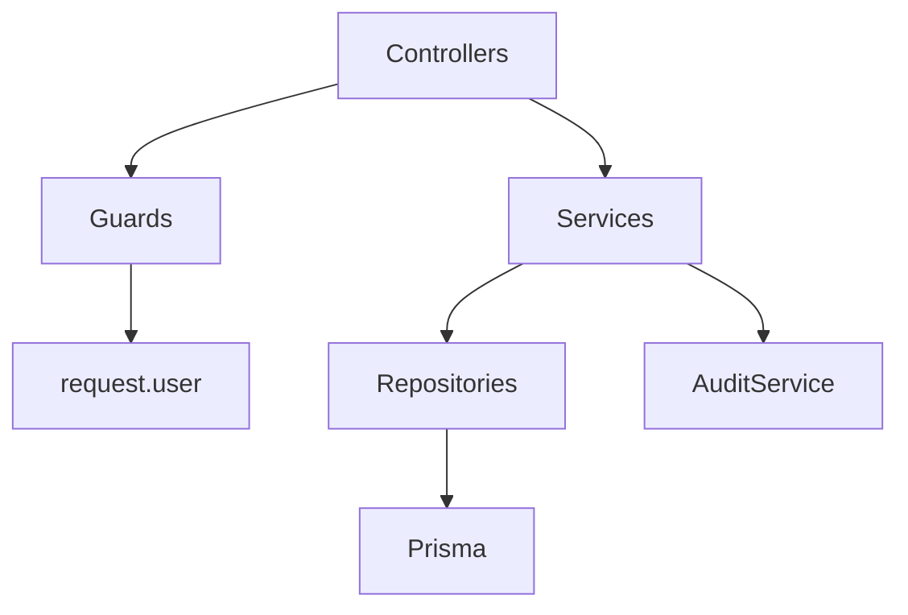

# Architecture

This backend uses a modular NestJS structure with explicit HTTP, application, and persistence boundaries.

## Module Responsibilities

- `auth`: credential verification, JWT access tokens, refresh token rotation, logout, `/me`.
- `tenants` and `organizations`: tenant context and tenant creation.
- `users`: user creation and tenant user listing.
- `memberships`: tenant membership role changes and removals.
- `roles`: tenant-scoped role definitions.
- `permissions`: permission catalog.
- `projects`: sample tenant-owned resource for object-level authorization.
- `audit`: security event write/read paths.
- `health`: live/ready/metrics endpoints.
- `database`: Prisma client lifecycle.
- `config`: strict environment validation.
- `common`: decorators, guards, authorization constants, and filters.

## Dependency Direction

Controllers handle HTTP concerns and DTOs. Services own application logic and business invariants. Repositories own Prisma access and must include tenant scope for tenant-owned resources.

## Tenant-Owned Resource Rule

Any endpoint that accepts a resource id must validate ownership through a tenant-scoped repository method. For example, project reads use both `id` and `organizationId`; updates and deletes use `updateMany`/`deleteMany` with both fields to avoid broken object-level authorization.

## Evolution Paths

- OIDC: add authorization code flow and JWKS publishing around the existing user and token model.
- SAML: add external IdP configuration per tenant.
- SCIM: add tenant-scoped user provisioning endpoints and external identifiers.
- Microsoft Entra ID / Google Workspace: add IdP connection tables, domain verification, group mapping, and provisioning jobs.
